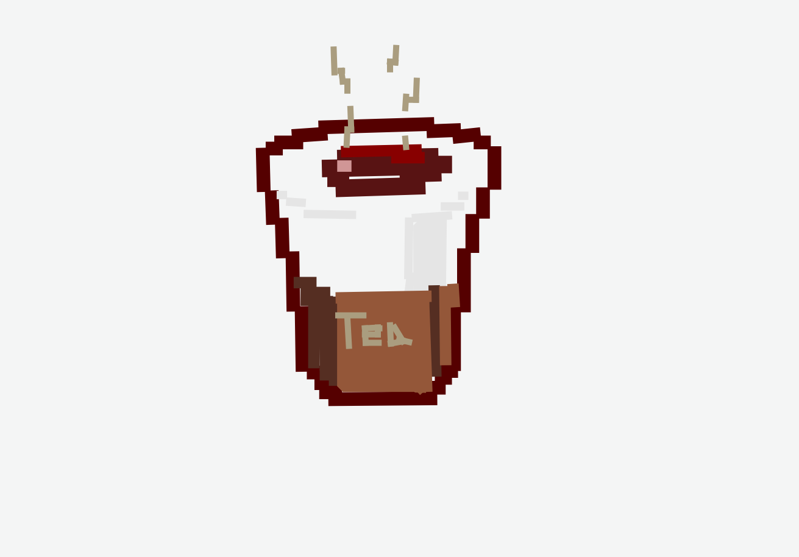
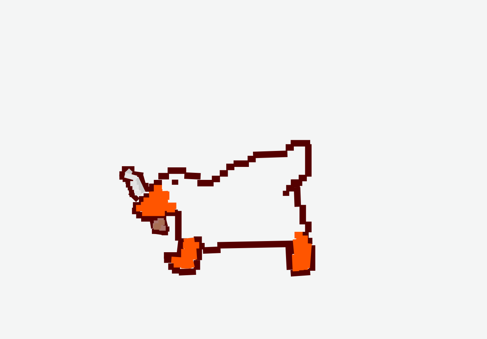

## Table of contents:
- [Introduction](#introduction)
- [Project Features](#project-features)
- [Project Structure](#project-structure)
- [Quick Preview](#quick-preview)
- [Examples of Artwork done using the program](#examples)
- [How to Run The Project](#run-the-project)


### Introduction
Qt C++ Desktop application Paint program that allows user to draw basic shapes like Rectangles, lines, circles and triangles.

### Project Features
- Draw Shapes (Rectangles, Lines, Circles, Triangles)
- Color Picker (Choose color from color wheel)
- Fill Shapes (Fill shapes with color)
- Stroke Shapes (Change stroke width & color)
- Save as PNG (Save painting as PNG file)
- Save your work (Save painting file)
- Load your work (Load painting file)
- Undo/Redo (Undo/Redo your last actions)
- Sort shapes (Sort shapes by area/premiter)
- Search shapes (Search for shapes by name)
- Clear Canvas

### Project Structure

The project is built using:
Qt Version: 6.15.2
- Frontend:
  - Qt C++
  - Qt Designer
  - Qt Creator
  - CSS
- Backend:
  - C++
  - Qt Creator


```
master
├─  Gallery (PNG & GIF)
├─  Resources (Images)
├─  UML (UML Diagrams)
├─  src
│  ├─  drawing
│  ├─  shapes
│  ├─  ui
│  ├─  utils
├─  main.cpp (main file)
├─  PaintFigure.pro (project file)
├─  README.md   
└─  .gitignore
```

### Quick Preview
1- Draw Shapes


2 - Save your work


3- Load your work


4 - undo/redo


5 - Sort shapes


6 - Search shapes


7 - Keep track of colors


### Examples:
 #### Tea
 
 #### Duck
  


### How to Run The Project
1. Download Qt & Qt Creator from [here](https://www.qt.io/download)
1. Clone the repository
2. Open the project file in Qt Creator (PaintFigure.pro)
3. Build the project
4. Run the project

